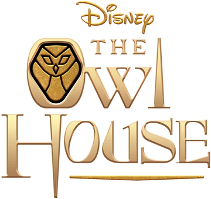

# Jogo da Memoria da Casa Coruja

## Descrição

    Um jogo da memoria feito em html, css e javascript inspirado em um desenho da disney.

 <a href="#objetivo">Objetivo</a>
 <a href="#roadmap">Roadmap</a> 
 <a href="#tecnologias">Tecnologias</a> 
 <a href="#contribuicao">Contribuição</a> 
 <a href="#licenc-a">Licença</a> 
 <a href="#autor">Autor</a>

###  Objetivo

    Desenvolver novas habilidade e aprimorar as já existentes por meio de um projeto de dificuldade media.

### Status do Projeto

<h4 align="center"> 
     🚀 Finalizado 🚀
</h4>

### 🛠 Tecnologias

As seguintes ferramentas foram usadas na construção do projeto:

-  (https://www.w3.org/html/)
-  (https://www.w3.org/Style/CSS/Overview.en.html)
-  (https://www.javascript.com/)

### Contribuições

### Licença

 

### Autor
Bruno Unias